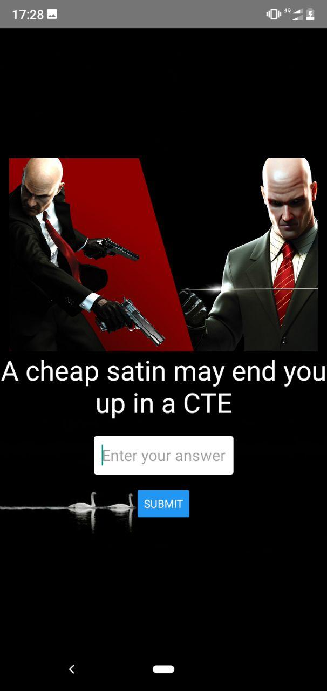

# road2tathva v2
**Road2Tathva** Companion app built with *React Native* for [**Adventure Club NIT-C**](https://www.instagram.com/adventureclubnitc/) as a part of [Tathva'19](tathva.org)

*This is a complete rewrite of the original* [road2tathva](https://github.com/falalurahman/Road-To-Tathva) *app*

## Screenshots
| | | |
|:-------------------------:|:-------------------------:|:-------------------------:|
| |  ||
|  |  ||
  

### Enhancements for V3?
- Store the images and questions elsewhere?, so that APK can't be decomplied to get the assets
- Animations
